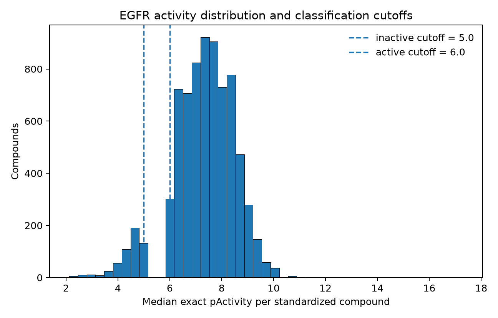
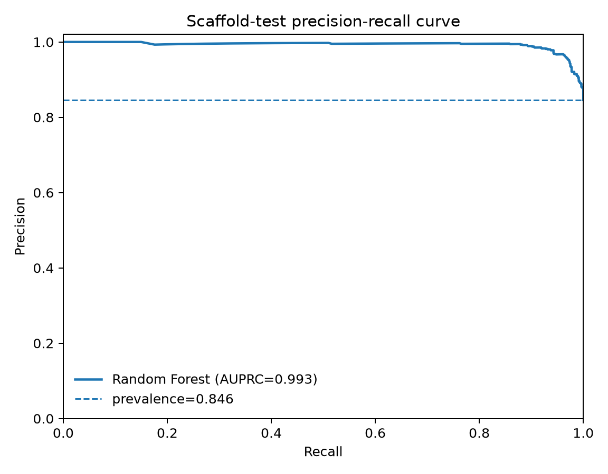
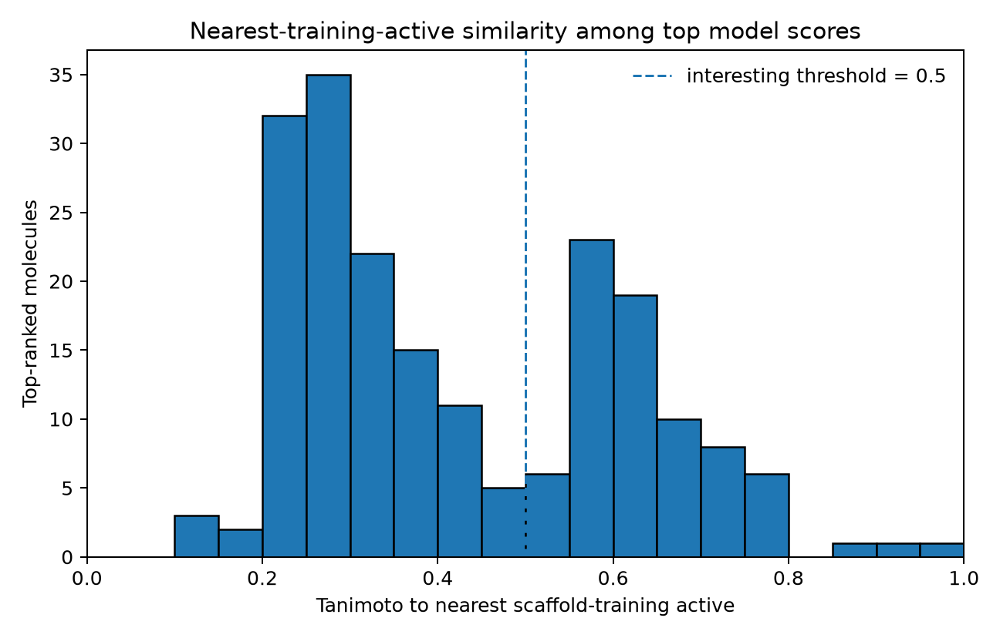
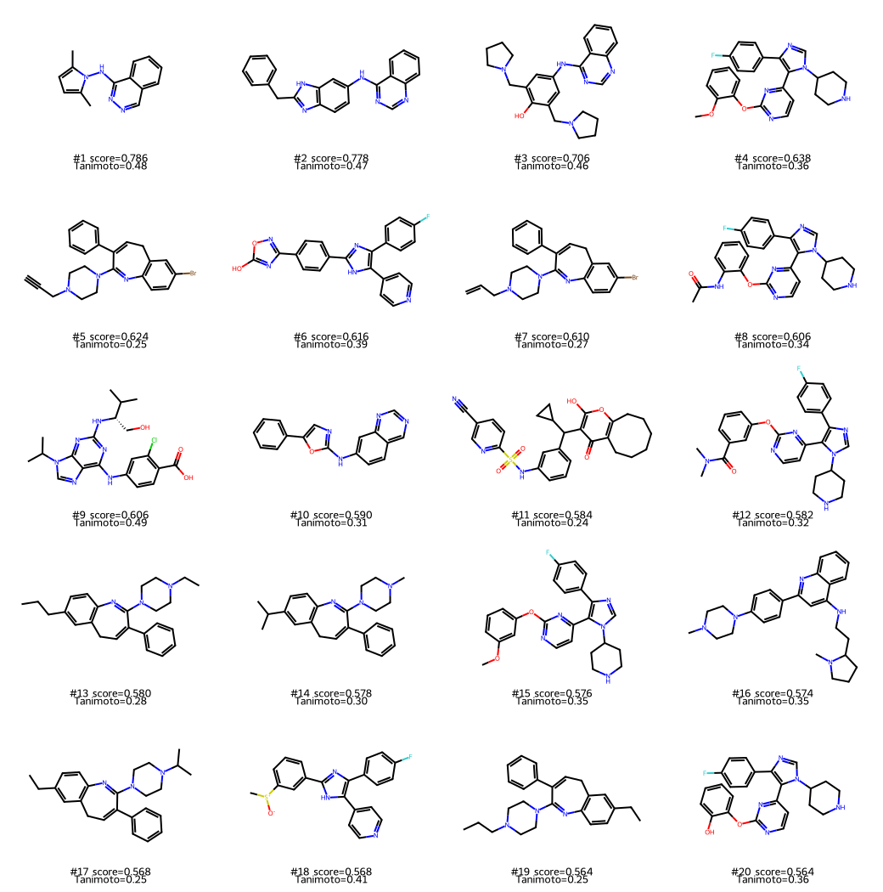

# EGFR Virtual Screen

[](https://github.com/drjoykarmakar/egfr-virtual-screen/actions/workflows/ci.yml)

A reproducible ligand-based EGFR virtual-screening benchmark built with RDKit, scikit-learn, PyTorch, and ChEMBL 37.

## Reviewer snapshot

- **Target:** human EGFR / ErbB1 (`CHEMBL203`)
- **Benchmark:** 9,476 standardized labeled compounds from 20,595 ChEMBL activity rows
- **Primary evaluation:** Bemis-Murcko scaffold split with zero scaffold overlap
- **Selected model:** Random Forest, chosen by scaffold-validation AUPRC only
- **Scaffold test:** AUROC **0.967**, AUPRC **0.993**
- **External screen:** 29,845 non-overlapping standardized molecules scored from a deterministic 30,000-molecule ChEMBL 37 slice
- **Central diagnostic:** 46/50 raw top scores were within Tanimoto >= 0.5 of a scaffold-training active; 15/50 were >= 0.7
- **Novelty-aware shortlist:** 20 property-filtered hypotheses with nearest-training-active Tanimoto strictly < 0.5
- **Not claimed:** experimental EGFR inhibition, a new drug, or prospective validation

## Scientific question

**If I train an activity model on cleaned EGFR ChEMBL data, how many of the highest-scoring molecules from an external public library are novel chemotypes rather than near-neighbor lookalikes of known actives?**

The screen is deliberately skeptical: model score and chemical novelty are reported separately. Exact standardized-SMILES overlap with the complete EGFR benchmark is removed before scoring, and novelty is measured only against actives in the scaffold-training partition.

## Data and labels

The EGFR snapshot was retrieved from ChEMBL 37 on **2026-09-27 UTC** (ChEMBL release date **2026-05-01**) for human `CHEMBL203`. It keeps `IC50`, `Ki`, and `Kd` measurements in nM. The frozen snapshot manifest records the query and SHA-256 checksum.

For measurements in nM:

```text
pActivity = 9 - log10(activity_nM)
```

- active: `pActivity >= 6.0` (<= 1,000 nM)
- inactive: `pActivity <= 5.0` (>= 10,000 nM)
- gray zone: `5.0 < pActivity < 6.0`, excluded

Exact (`=`) measurements are transformed directly. Censored measurements are labeled only when their bound guarantees the class (`<`/`<=` at <=1,000 nM; `>`/`>=` at >=10,000 nM). Censored bounds are never treated as exact potency values. Compounds with conflicting active/inactive labels after standardization are dropped.

### Cleaning audit

| Step | Count |
|---|---:|
| Raw ChEMBL activity rows | 20,595 |
| Parseable SMILES | 20,583 |
| Parent fragment obtained | 20,583 |
| Neutralized | 20,583 |
| Canonical non-empty SMILES | 20,583 |
| Relation-aware labeled rows | 17,421 |
| Rows excluded from classification | 3,162 |
| Unique standardized compounds before conflict removal | 9,778 |
| Conflicting compounds removed | 302 |
| Final classification compounds | 9,476 |
| Active / inactive | 7,869 / 1,607 |
| Unique Bemis-Murcko scaffolds | 3,621 |



## Models and evaluation

Both models use Morgan radius-2, 2,048-bit fingerprints plus MW, cLogP, TPSA, HBD, HBA, rotatable bonds, and QED. Morgan bits remain binary. For the Torch MLP, only continuous descriptors are standardized, using training-split statistics only.

Two protocols are reported: an easier stratified random split and the primary label-blind Bemis-Murcko scaffold split. Both use 80/10/10 train/validation/test partitions. Under the scaffold protocol, train, validation, and test contain **2,896 / 362 / 363** unique scaffolds respectively, with **zero scaffold overlap** between partitions.

| Split | Model | AUROC | AUPRC | Recall@1% | Recall@5% | EF@1% | EF@5% |
|---|---|---:|---:|---:|---:|---:|---:|
| Random | Random forest | 0.967 | 0.993 | 0.013 | 0.061 | 1.205 | 1.205 |
| Random | Torch MLP | 0.947 | 0.988 | 0.013 | 0.061 | 1.205 | 1.205 |
| Scaffold | Random forest | 0.967 | 0.993 | 0.012 | 0.060 | 1.182 | 1.182 |
| Scaffold | Torch MLP | 0.930 | 0.984 | 0.012 | 0.060 | 1.182 | 1.182 |

The Random Forest was selected for screening because its **scaffold-validation AUPRC was 0.9852**, compared with **0.9808** for the Torch MLP. Test metrics were not used for model selection. The small neural model did not outperform the fingerprint Random Forest, especially on the scaffold-held-out test set.



The high scaffold-test AUPRC should be interpreted in the context of the benchmark's strong class imbalance (83% active) and the chemical series represented in ChEMBL. It is not evidence of prospective clinical or medicinal-chemistry performance.

## External screen

The screening library is a **deterministic, target-agnostic 30,000-molecule small-molecule slice from ChEMBL 37**, frozen on **2026-09-26** under **CC BY-SA 3.0**. Candidate selection uses a SHA-256 ranking of `seed|molecule_chembl_id`; it does not query EGFR activity when constructing the library.

| Screening stage | Count |
|---|---:|
| Raw library molecules | 30,000 |
| Standardized duplicates removed | 80 |
| Exact EGFR benchmark overlaps removed | 75 |
| Final non-overlapping molecules scored | 29,845 |
| Passed MW/cLogP/QED property filters | 16,945 |
| Failed property filters | 12,900 |
| PAINS-flagged molecules in scored library | 1,448 |

The selected scaffold Random Forest ranks the library by `active_probability`. This is a model score, **not a calibrated probability that a compound will inhibit EGFR experimentally**.

Triage uses MW 200-600, cLogP -1 to 5, and QED >=0.4. PAINS is reported as a flag rather than used as a silent deletion rule. Nearest-active similarity is Morgan radius-2 Tanimoto against the **6,279 active compounds in scaffold training only**.

## Are the top scores mostly analogs?

Yes, many are close to known training actives:

- **46/50** raw top scores have nearest-training-active Tanimoto >= 0.5.
- **15/50** raw top scores have Tanimoto >= 0.7.
- The raw top-50 similarity median is **0.603** (IQR **0.577-0.727**).
- Across the top 200 scores, similarity median is **0.374** (IQR **0.261-0.593**).
- The pipeline examined 49 property-filtered candidates, in descending score order, to obtain 20 with Tanimoto strictly <0.5.

This is the central result: high predictive scores are frequently associated with analog retrieval. The low-similarity shortlist is therefore separated from the raw ranking instead of relaxing the novelty threshold after seeing the output.



## Novelty-aware top 20

The shortlist spans model scores **0.564-0.786** and nearest-training-active Tanimoto **0.244-0.494**. One of the 20 carries a PAINS alert. The shortlist is not diversity-selected, so multiple candidates may still be related to one another even though each is below the threshold relative to training actives.

| Rank | ChEMBL ID | Standardized SMILES | Score | QED | PAINS | Nearest-active Tanimoto | Risk note |
|---:|---|---|---:|---:|---|---:|---|
| 1 | `CHEMBL274442` | `Cc1ccc(C)n1Nc1nncc2ccccc12` | 0.786 | 0.746 | No | 0.476 | Lower-similarity extrapolation risk |
| 2 | `CHEMBL32464` | `c1ccc(Cc2nc3ccc(Nc4ncnc5ccccc45)cc3[nH]2)cc1` | 0.778 | 0.486 | No | 0.473 | Lower-similarity extrapolation risk |
| 3 | `CHEMBL26791` | `Oc1c(CN2CCCC2)cc(Nc2ncnc3ccccc23)cc1CN1CCCC1` | 0.706 | 0.599 | Yes | 0.462 | PAINS alert; extrapolation risk |
| 4 | `CHEMBL417804` | `COc1ccccc1Oc1nccc(-c2c(-c3ccc(F)cc3)ncn2C2CCNCC2)n1` | 0.638 | 0.456 | No | 0.357 | Lower-similarity extrapolation risk |
| 5 | `CHEMBL273794` | `C#CCN1CCN(C2=Nc3ccc(Br)cc3CC=C2c2ccccc2)CC1` | 0.624 | 0.672 | No | 0.250 | Lower-similarity extrapolation risk |
| 6 | `CHEMBL280457` | `Oc1nc(-c2ccc(-c3nc(-c4ccc(F)cc4)c(-c4ccncc4)[nH]3)cc2)no1` | 0.616 | 0.454 | No | 0.388 | Lower-similarity extrapolation risk |
| 7 | `CHEMBL16719` | `C=CCN1CCN(C2=Nc3ccc(Br)cc3CC=C2c2ccccc2)CC1` | 0.610 | 0.654 | No | 0.268 | Lower-similarity extrapolation risk |
| 8 | `CHEMBL14565` | `CC(=O)Nc1ccccc1Oc1nccc(-c2c(-c3ccc(F)cc3)ncn2C2CCNCC2)n1` | 0.606 | 0.418 | No | 0.341 | Lower-similarity extrapolation risk |
| 9 | `CHEMBL23254` | `CC(C)[C@H](CO)Nc1nc(Nc2ccc(C(=O)O)c(Cl)c2)c2ncn(C(C)C)c2n1` | 0.606 | 0.422 | No | 0.494 | Lower-similarity extrapolation risk |
| 10 | `CHEMBL285813` | `c1ccc(-c2cnc(Nc3ccc4cncnc4c3)o2)cc1` | 0.590 | 0.616 | No | 0.306 | Lower-similarity extrapolation risk |
| 11 | `CHEMBL276592` | `N#Cc1ccc(S(=O)(=O)Nc2cccc(C(c3c(O)oc4c(c3=O)CCCCCC4)C3CC3)c2)nc1` | 0.584 | 0.499 | No | 0.244 | Lower-similarity extrapolation risk |
| 12 | `CHEMBL14170` | `CN(C)C(=O)c1cccc(Oc2nccc(-c3c(-c4ccc(F)cc4)ncn3C3CCNCC3)n2)c1` | 0.582 | 0.430 | No | 0.324 | Lower-similarity extrapolation risk |
| 13 | `CHEMBL16672` | `CCCc1ccc2c(c1)CC=C(c1ccccc1)C(N1CCN(CC)CC1)=N2` | 0.580 | 0.755 | No | 0.275 | Lower-similarity extrapolation risk |
| 14 | `CHEMBL275361` | `CC(C)c1ccc2c(c1)CC=C(c1ccccc1)C(N1CCN(C)CC1)=N2` | 0.578 | 0.772 | No | 0.296 | Lower-similarity extrapolation risk |
| 15 | `CHEMBL14300` | `COc1cccc(Oc2nccc(-c3c(-c4ccc(F)cc4)ncn3C3CCNCC3)n2)c1` | 0.576 | 0.456 | No | 0.349 | Lower-similarity extrapolation risk |
| 16 | `CHEMBL21835` | `CN1CCN(c2ccc(-c3cc(NCCC4CCCN4C)c4ccccc4n3)cc2)CC1` | 0.574 | 0.622 | No | 0.345 | Lower-similarity extrapolation risk |
| 17 | `CHEMBL16588` | `CCc1ccc2c(c1)CC=C(c1ccccc1)C(N1CCN(C(C)C)CC1)=N2` | 0.568 | 0.758 | No | 0.250 | Lower-similarity extrapolation risk |
| 18 | `CHEMBL276529` | `C[S+]([O-])c1cccc(-c2nc(-c3ccc(F)cc3)c(-c3ccncc3)[nH]2)c1` | 0.568 | 0.525 | No | 0.406 | Lower-similarity extrapolation risk |
| 19 | `CHEMBL16635` | `CCCN1CCN(C2=Nc3ccc(CC)cc3CC=C2c2ccccc2)CC1` | 0.564 | 0.755 | No | 0.250 | Lower-similarity extrapolation risk |
| 20 | `CHEMBL273432` | `Oc1ccccc1Oc1nccc(-c2c(-c3ccc(F)cc3)ncn2C2CCNCC2)n1` | 0.564 | 0.482 | No | 0.357 | Lower-similarity extrapolation risk |



Full machine-readable outputs are in `results/lists/top50_raw.csv`, `top50_filtered.csv`, and `top20_interesting.csv`. `results/tables/screen_summary.json` contains the screening audit and similarity statistics.

## What did not work / what was filtered out

- **3,162** cleaned activity rows were excluded from classification because they fell in the gray zone or had censoring that did not guarantee a class.
- **302** standardized compounds were removed for conflicting active/inactive labels.
- Two alternative Random Forest settings did not improve scaffold-validation AUPRC over the selected 500-tree `sqrt`, leaf-size-1 setting; the Torch MLP also scored lower on scaffold validation.
- **75** external-library molecules were removed as exact standardized-SMILES overlaps with the EGFR benchmark, and **80** standardized duplicates were removed.
- **32/50** raw top-scoring molecules failed at least one simple MW/cLogP/QED property filter.
- **46/50** raw top-scoring molecules were within Tanimoto >=0.5 of a scaffold-training active, showing that a high model score often corresponds to analog retrieval rather than a clearly novel chemotype.
- RDKit emitted a small number of kekulization warnings while reading the external library; invalid representations were handled by the standardization path rather than treated as valid structures.

## Limitations

- ChEMBL combines assays with different protocols, contexts, and experimental uncertainty.
- IC50, Ki, and Kd are pooled for a deliberately simple benchmark; they are not physically interchangeable measurements.
- Binary thresholds discard information, and the 1-10 uM gray zone is intentionally omitted.
- The dataset is highly imbalanced (7,869 active vs 1,607 inactive), so accuracy is not used as the headline metric.
- A scaffold split is more demanding than a random split but is not equivalent to prospective medicinal-chemistry deployment.
- The external library comes from the same broad ChEMBL ecosystem as the benchmark. Exact benchmark overlap is removed, but this is not a temporal or vendor-independent prospective screen.
- Tanimoto novelty is fingerprint-dependent. The `<0.5` criterion measures distance from training actives, not diversity within the shortlist.
- PAINS and simple physicochemical rules are triage flags, not experimental evidence.
- No selectivity, exposure, toxicity, permeability, metabolism, synthesis, docking, crystal-structure evidence, or wet-lab assay evidence is generated here.

> **These compounds are computationally ranked hypotheses. They have not been synthesized or assayed in this repository.**

## Reproduce the workflow

Python 3.11 is the reference environment.

```bash
python3.11 -m venv .venv
source .venv/bin/activate
python -m pip install --upgrade pip
python -m pip install -r requirements.txt
python -m pytest -q

python scripts/prepare_data.py --config configs/default.yaml
python scripts/run_baseline.py --config configs/default.yaml
python scripts/run_torch.py --config configs/default.yaml
python scripts/make_report.py --config configs/default.yaml
python scripts/prepare_screening_library.py --config configs/default.yaml
python scripts/run_screen.py --config configs/default.yaml
```

`prepare_data.py` freezes the ChEMBL activity snapshot and manifest. `prepare_screening_library.py` creates the deterministic 30k target-agnostic library and provenance manifest. `run_screen.py` refuses to proceed without the model-selection record and library provenance.

Large raw snapshots, processed datasets, virtual environments, and serialized model artifacts are intentionally ignored by git. The committed result tables, ranked lists, figures, source code, configuration, tests, and manifests are sufficient to audit the reported run; the ignored artifacts can be regenerated from the documented workflow.

## Repository map

```text
configs/default.yaml                  experiment configuration
src/                                  cleaning, features, splits, models, evaluation, screening
scripts/prepare_data.py               freeze/clean EGFR ChEMBL benchmark
scripts/run_baseline.py               RF tuning + random/scaffold evaluation
scripts/run_torch.py                  fingerprint MLP + early stopping
scripts/make_report.py                model comparison, selection, benchmark figures
scripts/prepare_screening_library.py  deterministic 30k ChEMBL library snapshot
scripts/run_screen.py                 overlap removal, scoring, filters, similarity triage
results/tables/                       metrics, split audits, selection and screen summary
results/lists/                        ranked screening outputs
results/figures/                      benchmark and screening figures
tests/                                unit/integration tests
```

## Scope

This repository does not present any molecule as an experimentally confirmed EGFR inhibitor, claim a development candidate, or claim superiority over an industrial drug-discovery program. It is a laptop-sized, reproducible demonstration of careful activity labeling, scaffold-aware evaluation, model comparison, external-library ranking, and explicit analog-retrieval diagnostics.
